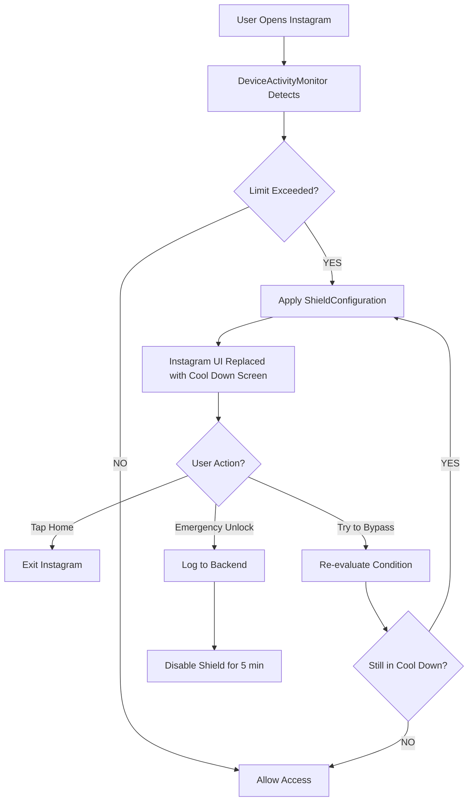
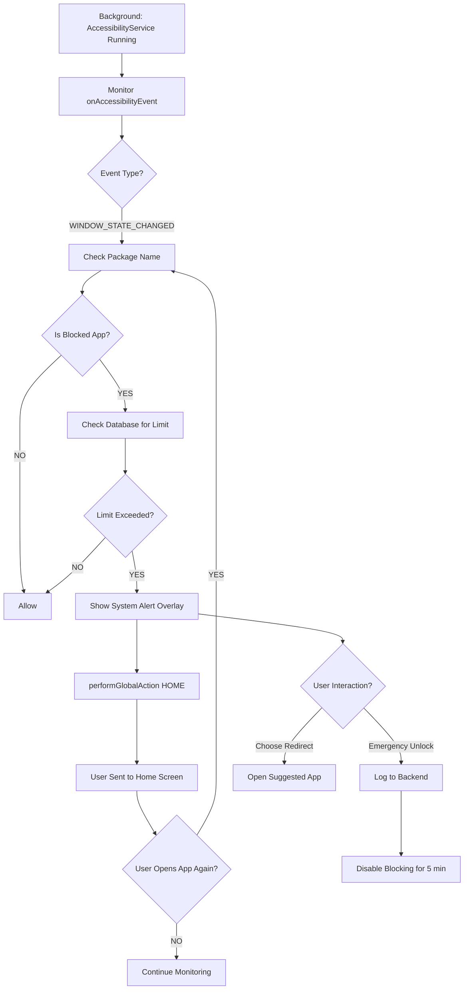

# Native Blocking Implementation Guide

## Based on Research: "Loop of Persistence" Strategy

This document provides concrete implementation steps for **app blocking** on both iOS and Android platforms.

---

## 🍎 iOS Implementation: The "Annoying Friend" Strategy

### Overview
iOS doesn't allow aggressive app termination, but the **Screen Time API** provides a better solution: **Shield Configuration** that replaces the app's interface with your custom "Cool Down" screen.

### Architecture



### Required Components

#### 1. **Device Activity Extension**

Create an App Extension target in Xcode:
```
File > New > Target > Device Activity Monitor Extension
```

**DeviceActivityMonitor.swift**:
```swift
import DeviceActivity
import ManagedSettings

class ReclamDeviceActivityMonitor: DeviceActivityMonitor {
    
    override func intervalDidStart(for activity: DeviceActivityName) {
        super.intervalDidStart(for: activity)
        
        // User opened a blocked app during cool-down
        // Apply shield immediately
        applyBlockingShield()
    }
    
    override func intervalDidEnd(for activity: DeviceActivityName) {
        super.intervalDidEnd(for: activity)
        
        // Cool-down period ended, remove shield
        removeBlockingShield()
    }
    
    private func applyBlockingShield() {
        let store = ManagedSettingsStore()
        
        // Get blocked apps from shared container
        let blockedApps = getBlockedAppsFromSharedContainer()
        
        // Create shield configuration
        let shieldConfig = ShieldConfiguration(
            backgroundBlurStyle: .systemMaterial,
            backgroundColor: UIColor.systemIndigo,
            icon: UIImage(systemName: "moon.zzz.fill"),
            title: ShieldConfiguration.Label(
                text: "Time for a Cool Down",
                color: .white
            ),
            subtitle: ShieldConfiguration.Label(
                text: "You've reached your limit. Take a mindful break.",
                color: .white.withAlphaComponent(0.8)
            ),
            primaryButtonLabel: ShieldConfiguration.Label(
                text: "Choose Redirect",
                color: .white
            ),
            primaryButtonBackgroundColor: UIColor.systemGreen,
            secondaryButtonLabel: ShieldConfiguration.Label(
                text: "Emergency Unlock (5 min)",
                color: .white
            )
        )
        
        // Apply shield to blocked apps
        store.shield.applications = blockedApps
        store.shield.applicationCategories = .all(including: [.socialNetworking, .entertainment])
    }
    
    private func removeBlockingShield() {
        let store = ManagedSettingsStore()
        store.shield.applications = nil
        store.shield.applicationCategories = nil
    }
}
```

#### 2. **Shield Configuration Handler**

**ShieldConfigurationExtension.swift**:
```swift
import ManagedSettings
import ManagedSettingsUI

class ShieldConfigurationProvider: ShieldConfigurationDataSource {
    
    override func configuration(shielding application: Application) -> ShieldConfiguration {
        // Custom shield for specific apps
        return ShieldConfiguration(
            backgroundBlurStyle: .systemMaterial,
            backgroundColor: UIColor(red: 0.4, green: 0.3, blue: 0.8, alpha: 1.0),
            icon: UIImage(systemName: "moon.zzz.fill"),
            title: ShieldConfiguration.Label(
                text: "Cool Down Active",
                color: .white
            ),
            subtitle: ShieldConfiguration.Label(
                text: "Breathe. You've got this. Choose a redirect activity.",
                color: .white.withAlphaComponent(0.9)
            ),
            primaryButtonLabel: ShieldConfiguration.Label(
                text: "Redirect Me",
                color: .white
            ),
            primaryButtonBackgroundColor: UIColor.systemGreen
        )
    }
    
    override func configuration(shielding webDomain: WebDomain) -> ShieldConfiguration {
        // Shield for web domains (if blocking mobile browsers)
        return ShieldConfiguration(
            backgroundBlurStyle: .systemMaterial,
            icon: UIImage(systemName: "safari.fill"),
            title: ShieldConfiguration.Label(text: "Mobile Safari Blocked", color: .white),
            subtitle: ShieldConfiguration.Label(text: "Try a different activity", color: .white)
        )
    }
}
```

#### 3. **Main App Integration**

**ReclaimApp.swift** (in main app target):
```swift
import SwiftUI
import FamilyControls
import DeviceActivity

@main
struct ReclaimApp: App {
    @State private var isAuthorized = false
    
    var body: some Scene {
        WindowGroup {
            if isAuthorized {
                ContentView()
            } else {
                AuthorizationRequestView(isAuthorized: $isAuthorized)
            }
        }
    }
}

struct AuthorizationRequestView: View {
    @Binding var isAuthorized: Bool
    
    var body: some View {
        VStack(spacing: 20) {
            Image(systemName: "shield.checkered")
                .font(.system(size: 60))
                .foregroundColor(.blue)
            
            Text("Reclaim needs permission")
                .font(.title)
            
            Text("To block apps effectively, we need Screen Time permissions.")
                .multilineTextAlignment(.center)
                .padding()
            
            Button("Grant Permission") {
                requestAuthorization()
            }
            .buttonStyle(.borderedProminent)
        }
        .padding()
    }
    
    private func requestAuthorization() {
        Task {
            do {
                try await AuthorizationCenter.shared.requestAuthorization(for: .individual)
                
                // Check if authorization was successful
                switch AuthorizationCenter.shared.authorizationStatus {
                case .approved:
                    await MainActor.run {
                        isAuthorized = true
                    }
                default:
                    print("Authorization not granted")
                }
            } catch {
                print("Authorization error: \(error)")
            }
        }
    }
}
```

#### 4. **Setting Up Monitoring**

**BlockingManager.swift**:
```swift
import DeviceActivity
import FamilyControls

class BlockingManager: ObservableObject {
    private let store = ManagedSettingsStore()
    private let center = DeviceActivityCenter()
    
    func startMonitoring(blockedApps: Set<ApplicationToken>, duration: TimeInterval) {
        // Create schedule
        let schedule = DeviceActivitySchedule(
            intervalStart: DateComponents(hour: 0, minute: 0),
            intervalEnd: DateComponents(hour: 23, minute: 59),
            repeats: true
        )
        
        let activityName = DeviceActivityName("reclaim-blocking")
        
        do {
            try center.startMonitoring(activityName, during: schedule)
            
            // Apply shield to specified apps
            store.shield.applications = blockedApps
            
            print("Monitoring started for \(blockedApps.count) apps")
        } catch {
            print("Failed to start monitoring: \(error)")
        }
    }
    
    func stopMonitoring() {
        let activityName = DeviceActivityName("reclaim-blocking")
        center.stopMonitoring([activityName])
        
        // Remove shields
        store.shield.applications = nil
        store.shield.applicationCategories = nil
    }
    
    func emergencyUnlock(duration: TimeInterval = 300) {
        // Remove shield for 5 minutes
        store.shield.applications = nil
        
        // Log to backend
        logEmergencyUnlock()
        
        // Re-enable after duration
        DispatchQueue.main.asyncAfter(deadline: .now() + duration) {
            // Re-apply shields
            self.reapplyShields()
        }
    }
}
```

### Key iOS Limitations

1. **No App Termination**: Cannot force-close apps
2. **User Can Still Bypass**: They can ignore Screen Time limits IF they know device passcode
3. **Requires Entitlement**: Only apps with Family Controls entitlement can use this
4. **Shield Customization Limited**: Can customize text/icons but not full UI

### The "Loop" Implementation

The "annoyance loop" happens automatically:
1. User opens Instagram → Shield appears
2. User tries to use app → Can't, shield is there
3. User taps home → Exits
4. User opens Instagram again → Shield appears again
5. **Repeat until cool-down expires**

---

## 🤖 Android Implementation: The "Bouncer" Strategy

### Overview
Android allows much more aggressive blocking using **AccessibilityService**. You can literally throw the user out of the app every time they try to open it.

### Architecture



### Required Components

#### 1. **Accessibility Service**

**AndroidManifest.xml**:
```xml
<manifest>
    <!-- Permissions -->
    <uses-permission android:name="android.permission.PACKAGE_USAGE_STATS" />
    <uses-permission android:name="android.permission.SYSTEM_ALERT_WINDOW" />
    <uses-permission android:name="android.permission.FOREGROUND_SERVICE" />
    <uses-permission android:name="android.permission.REQUEST_IGNORE_BATTERY_OPTIMIZATIONS" />
    
    <application>
        <!-- Accessibility Service -->
        <service
            android:name=".services.AppBlockerAccessibilityService"
            android:permission="android.permission.BIND_ACCESSIBILITY_SERVICE"
            android:exported="true">
            <intent-filter>
                <action android:name="android.accessibilityservice.AccessibilityService" />
            </intent-filter>
            
            <meta-data
                android:name="android.accessibilityservice"
                android:resource="@xml/accessibility_service_config" />
        </service>
        
        <!-- System Alert Activity -->
        <activity
            android:name=".activities.BlockOverlayActivity"
            android:theme="@style/Theme.Transparent.Fullscreen"
            android:launchMode="singleInstance"
            android:excludeFromRecents="true"
            android:taskAffinity=""
            android:exported="false" />
    </application>
</manifest>
```

**res/xml/accessibility_service_config.xml**:
```xml
<?xml version="1.0" encoding="utf-8"?>
<accessibility-service
    xmlns:android="http://schemas.android.com/apk/res/android"
    android:accessibilityEventTypes="typeWindowStateChanged|typeWindowContentChanged"
    android:accessibilityFeedbackType="feedbackGeneric"
    android:accessibilityFlags="flagReportViewIds|flagRetrieveInteractiveWindows"
    android:canRetrieveWindowContent="true"
    android:description="@string/accessibility_service_description"
    android:notificationTimeout="100"
    android:packageNames="com.instagram.android,com.zhiliaoapp.musically,com.snapchat.android" />
```

#### 2. **The Accessibility Service Implementation**

**AppBlockerAccessibilityService.kt**:
```kotlin
package com.reclaim.app.services

import android.accessibilityservice.AccessibilityService
import android.content.Intent
import android.view.accessibility.AccessibilityEvent
import android.widget.Toast
import kotlinx.coroutines.*

class AppBlockerAccessibilityService : AccessibilityService() {
    
    private val scope = CoroutineScope(Dispatchers.Main + Job())
    private var blockedApps: Set<String> = emptySet()
    private val coolDownApps = mutableMapOf<String, Long>() // packageName -> endTime
    
    override fun onServiceConnected() {
        super.onServiceConnected()
        
        // Load blocked apps from database/shared preferences
        loadBlockedApps()
        
        Toast.makeText(this, "Reclaim Protection Active", Toast.LENGTH_SHORT).show()
    }
    
    override fun onAccessibilityEvent(event: AccessibilityEvent) {
        if (event.eventType != AccessibilityEvent.TYPE_WINDOW_STATE_CHANGED) {
            return
        }
        
        val packageName = event.packageName?.toString() ?: return
        
        // Ignore our own app
        if (packageName == this.packageName) {
            return
        }
        
        // Check if this app is blocked
        if (shouldBlockApp(packageName)) {
            blockApp(packageName)
        }
    }
    
    private fun shouldBlockApp(packageName: String): Boolean {
        // Check if in blocked list
        if (packageName !in blockedApps) {
            return false
        }
        
        // Check if in cool-down period
        val coolDownEnd = coolDownApps[packageName]
        if (coolDownEnd != null && System.currentTimeMillis() < coolDownEnd) {
            // Still in cool-down from emergency unlock
            return false
        }
        
        // Check database for limit exceeded
        return isLimitExceeded(packageName)
    }
    
    private fun blockApp(packageName: String) {
        // Send user to home screen
        performGlobalAction(GLOBAL_ACTION_HOME)
        
        // Show blocking overlay
        scope.launch {
            delay(300) // Small delay to let home screen appear
            showBlockOverlay(packageName)
        }
        
        // Log block event to backend
        logBlockEvent(packageName)
    }
    
    private fun showBlockOverlay(packageName: String) {
        val intent = Intent(this, BlockOverlayActivity::class.java).apply {
            addFlags(Intent.FLAG_ACTIVITY_NEW_TASK)
            addFlags(Intent.FLAG_ACTIVITY_CLEAR_TOP)
            putExtra("blocked_package", packageName)
            putExtra("app_name", getAppName(packageName))
        }
        startActivity(intent)
    }
    
    override fun onInterrupt() {
        // Service interrupted
    }
    
    override fun onDestroy() {
        super.onDestroy()
        scope.cancel()
    }
    
    // Helper functions
    private fun loadBlockedApps() {
        // TODO: Load from database
        blockedApps = setOf(
            "com.instagram.android",
            "com.zhiliaoapp.musically",
            "com.snapchat.android"
        )
    }
    
    private fun isLimitExceeded(packageName: String): Boolean {
        // TODO: Check with backend/database
        return true // For now, always block
    }
    
    private fun logBlockEvent(packageName: String) {
        // TODO: Log to Supabase backend
    }
    
    private fun getAppName(packageName: String): String {
        return try {
            val appInfo = packageManager.getApplicationInfo(packageName, 0)
            packageManager.getApplicationLabel(appInfo).toString()
        } catch (e: Exception) {
            "App"
        }
    }
}
```

#### 3. **Block Overlay Activity**

**BlockOverlayActivity.kt**:
```kotlin
package com.reclaim.app.activities

import android.os.Bundle
import android.view.WindowManager
import androidx.activity.ComponentActivity
import androidx.activity.compose.setContent
import androidx.compose.foundation.background
import androidx.compose.foundation.layout.*
import androidx.compose.material3.*
import androidx.compose.runtime.*
import androidx.compose.ui.Alignment
import androidx.compose.ui.Modifier
import androidx.compose.ui.graphics.Color
import androidx.compose.ui.text.font.FontWeight
import androidx.compose.ui.unit.dp
import androidx.compose.ui.unit.sp

class BlockOverlayActivity : ComponentActivity() {
    
    override fun onCreate(savedInstanceState: Bundle?) {
        super.onCreate(savedInstanceState)
        
        // Make fullscreen
        window.setFlags(
            WindowManager.LayoutParams.FLAG_FULLSCREEN,
            WindowManager.LayoutParams.FLAG_FULLSCREEN
        )
        
        // Get data
        val blockedPackage = intent.getStringExtra("blocked_package") ?: ""
        val appName = intent.getStringExtra("app_name") ?: "this app"
        
        setContent {
            BlockScreen(
                appName = appName,
                onRedirect = { activity ->
                    // Open suggested activity
                    openRedirectActivity(activity)
                    finish()
                },
                onEmergencyUnlock = {
                    // Grant 5-minute emergency access
                    grantEmergencyAccess(blockedPackage)
                    finish()
                },
                onGoHome = {
                    finish()
                }
            )
        }
    }
    
    private fun openRedirectActivity(activity: String) {
        // TODO: Open reading app, meditation app, etc.
    }
    
    private fun grantEmergencyAccess(packageName: String) {
        // TODO: Notify AccessibilityService to allow for 5 minutes
        // Log to backend
    }
}

@Composable
fun BlockScreen(
    appName: String,
    onRedirect: (String) -> Unit,
    onEmergencyUnlock: () -> Unit,
    onGoHome: () -> Unit
) {
    Box(
        modifier = Modifier
            .fillMaxSize()
            .background(Color(0xFF6366F1)), // Indigo
        contentAlignment = Alignment.Center
    ) {
        Column(
            horizontalAlignment = Alignment.CenterHorizontally,
            modifier = Modifier.padding(32.dp)
        ) {
            Text(
                text = "🌙",
                fontSize = 80.sp
            )
            
            Spacer(modifier = Modifier.height(24.dp))
            
            Text(
                text = "Time for a Cool Down",
                fontSize = 28.sp,
                fontWeight = FontWeight.Bold,
                color = Color.White
            )
            
            Spacer(modifier = Modifier.height(12.dp))
            
            Text(
                text = "You've reached your limit for $appName. Choose a healthier activity.",
                fontSize = 16.sp,
                color = Color.White.copy(alpha = 0.9f)
            )
            
            Spacer(modifier = Modifier.height(32.dp))
            
            // Redirect options
            Column(spacing = 12.dp) {
                RedirectButton("📚 Read an Article", onClick = { onRedirect("read") })
                RedirectButton("🏃 Exercise", onClick = { onRedirect("exercise") })
                RedirectButton("🧘 Meditate", onClick = { onRedirect("meditate") })
            }
            
            Spacer(modifier = Modifier.height(24.dp))
            
            // Emergency unlock
            TextButton(onClick = onEmergencyUnlock) {
                Text(
                    "Emergency Unlock (5 min)",
                    color = Color.White.copy(alpha = 0.7f)
                )
            }
        }
    }
}
```

#### 4. **Battery Optimization Exclusion**

**In your onboarding or settings:**
```kotlin
import android.content.Intent
import android.net.Uri
import android.os.PowerManager
import android.provider.Settings

fun requestBatteryOptimizationExemption(context: Context) {
    val powerManager = context.getSystemService(Context.POWER_SERVICE) as PowerManager
    
    if (!powerManager.isIgnoringBatteryOptimizations(context.packageName)) {
        val intent = Intent().apply {
            action = Settings.ACTION_REQUEST_IGNORE_BATTERY_OPTIMIZATIONS
            data = Uri.parse("package:${context.packageName}")
        }
        context.startActivity(intent)
    }
}
```

### The "Infinite Loop" Strategy

The loop works like this:

1. **User opens Instagram** → AccessibilityService detects `WINDOW_STATE_CHANGED`
2. **Check if blocked** → Yes, limit exceeded
3. **performGlobalAction(HOME)** → User sent to home screen
4. **Show overlay** → "Still Cooling Down" message appears
5. **User dismisses overlay** → Goes away
6. **User opens Instagram again** → **Back to step 1**

The key is that steps 1-6 happen **instantly** every time. The user cannot access Instagram without going through this friction.

---

## 🎯 Implementation Priority

### Phase 1: Android (Easier to Test)
1. Create AccessibilityService
2. Implement block overlay
3. Test infinite loop
4. Add battery optimization handling
5. Wire to backend

### Phase 2: iOS (Requires More Setup)
1. Add Family Controls capability
2. Create Device Activity extension
3. Implement Shield Configuration
4. Test on physical device (won't work in simulator)
5. Wire to backend

---

## 🚨 Critical Gotchas

### iOS
- Requires **physical device** (simulator won't work)
- Need to enable **Family Controls** capability in Xcode
- User must grant Screen Time permission
- Cannot be tested in development without proper provisioning

### Android
- Accessibility permission is CRITICAL
- Battery optimization must be disabled
- Some manufacturers (Samsung, Xiaomi) have extra restrictions
- Must handle "Force Stop" scenario

---

## 📱 User Experience Flow

### First Time Setup

**iOS:**
1. Request Screen Time authorization
2. User goes to Settings → Family → [Your App]
3. Grants permission
4. Select apps to block in your app
5. Blocking begins immediately

**Android:**
1. Request Accessibility permission
2. Request battery optimization exemption
3. Request overlay permission
4. Select apps to block
5. Blocking begins immediately

### Daily Usage

**Both Platforms:**
1. User tries to open blocked app
2. **iOS**: Shield replaces app UI
3. **Android**: Sent home + overlay appears
4. User chooses redirect OR emergency unlock
5. Backend logs the event
6. Stats updated in real-time

---

## 🎨 Alignment with Reclaim's Philosophy

This approach is **perfect** for our "ethical, non-judgmental" design:

✅ **Not Punitive**: We don't "block" forever, we encourage a "cool down"
✅ **User Has Control**: Emergency unlock option available  
✅ **Supportive Language**: "Time for a cool down" vs "ACCESS DENIED"
✅ **Redirects, Not Restrictions**: Offers healthier alternatives
✅ **Transparent**: User knows exactly what's happening

The "annoyance loop" works **with** human psychology, not against it.

---

## Next Steps

1. **Android**: Implement AccessibilityService first (easier to test)
2. **iOS**: Set up Device Activity extension
3. **Backend Integration**: Wire both to existing Supabase services
4. **Testing**: Real device testing on both platforms
5. **Refinement**: Adjust based on user feedback

This is **100% achievable** and aligns perfectly with our architecture! 🚀
